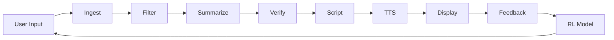

# 🕳️ Blackhole Infiverse LLP - News AI Frontend

> **Advanced AI-Powered News Analysis Platform**  
> Real-time news processing with TTS, sentiment analysis, and reinforcement learning feedback


---

## 📋 Table of Contents

- [Overview](#overview)
- [Features](#features)
- [Tech Stack](#tech-stack)
- [Project Structure](#project-structure)
- [Getting Started](#getting-started)
- [API Integration](#api-integration)
- [Components](#components)
- [Flow Diagram](#flow-diagram)
- [Environment Variables](#environment-variables)
- [Development](#development)
- [Deployment](#deployment)
- [Contributing](#contributing)

---

## 🌟 Overview

The News AI Frontend is a sophisticated web application that provides real-time news analysis powered by artificial intelligence. It features a complete pipeline from content ingestion to text-to-speech audio generation, with integrated feedback mechanisms for continuous improvement through reinforcement learning.

### Key Capabilities

- **🔴 Live Dashboard**: Real-time news processing with visual pipeline tracking
- **📰 News Feed**: Browse curated news from multiple sources
- **🎙️ TTS Audio Player**: Listen to AI-generated audio summaries
- **🧠 AI Insights**: Sentiment analysis, bias detection, and credibility scoring
- **💬 Feedback System**: Reinforcement learning-powered improvement
- **📊 Analytics**: Comprehensive system monitoring and statistics

---

## ✨ Features

### 1. **Live News Processing Pipeline**
```
Ingest → Filter → Summarize → Verify → Script → TTS → Feedback
```

- Real-time status updates for each stage
- Visual progress indicators
- Error handling and retry mechanisms
- Processing time analytics

### 2. **Advanced AI Analysis**

- **Sentiment Detection**: Positive, negative, neutral, excited, concerned, hopeful
- **Tone Analysis**: Informative, urgent, serious, optimistic, scientific
- **Credibility Scoring**: 0-100% authenticity rating
- **Bias Detection**: Minimal, low, moderate, high bias classification
- **Entity Recognition**: Key people, organizations, and locations
- **Keyword Extraction**: Main topics and themes

### 3. **Interactive TTS Player**

- Play/pause/restart controls
- Volume adjustment and mute
- Progress tracking with seek functionality
- Download and share capabilities
- Playback statistics

### 4. **Reinforcement Learning Feedback**

- **Like**: Positive content approval
- **Skip**: Improve future recommendations
- **Approve**: High-quality content marker
- **Flag**: Report problematic content
- Local storage for analytics
- Model versioning and accuracy tracking

### 5. **Responsive Design**

- Mobile-first approach
- Tablet and desktop optimized
- Glass-morphism UI effects
- Custom animations and transitions
- Dark mode support

---

## 🛠️ Tech Stack

### Frontend Framework
- **Next.js 14** - React framework with App Router
- **TypeScript** - Type-safe development
- **Tailwind CSS** - Utility-first styling

### UI Components
- **Lucide React** - Icon library
- **Custom Components** - Modular, reusable design

### State Management
- **React Hooks** - useState, useEffect, useRef
- **Local Storage** - Client-side persistence

### API Integration
- **Fetch API** - HTTP requests
- **Custom Service Layer** - Centralized API handling
- **Mock Data Support** - Development fallback

---

## 📁 Project Structure

```
blackhole-frontend/
├── app/
│   ├── page.tsx                 # Home - News Analysis
│   ├── live/
│   │   └── page.tsx            # Live Dashboard
│   ├── feed/
│   │   └── page.tsx            # News Feed Browser
│   ├── dashboard/
│   │   └── page.tsx            # Analytics Dashboard
│   ├── advanced/
│   │   └── page.tsx            # Advanced Analysis
│   ├── testing/
│   │   └── page.tsx            # Testing Interface
│   ├── layout.tsx              # Root Layout
│   └── globals.css             # Global Styles
│
├── components/
│   ├── Header.tsx              # Navigation Header
│   ├── BackendStatus.tsx       # Backend Health Indicator
│   ├── NewsAnalysisCard.tsx    # Main Analysis Interface
│   ├── ResultsDisplay.tsx      # Analysis Results
│   ├── VideoPlayer.tsx         # Video Playback
│   ├── TTSPlayer.tsx           # Audio Player with Controls
│   ├── PipelineViewer.tsx      # Visual Pipeline Tracker
│   ├── AIInsights.tsx          # AI Analysis Display
│   ├── FeedbackPanel.tsx       # RL Feedback System
│   ├── LiveFeedViewer.tsx      # Real-time Feed Display
│   └── NewsCard.tsx            # News Item Card
│
├── services/
│   └── api.js                  # Centralized API Service
│
├── lib/
│   └── api.ts                  # API Utilities
│
└── public/
    └── audio/                  # Sample Audio Files

```

---

## 🚀 Getting Started

### Prerequisites

- **Node.js** 18+ 
- **npm** or **yarn**
- **Backend API** (optional, uses mock data if unavailable)

### Installation

1. **Clone the repository**
```bash
git clone <repository-url>
cd blackhole-frontend
```

2. **Install dependencies**
```bash
npm install
# or
yarn install
```

3. **Set up environment variables**
```bash
cp .env.example .env.local
```

Edit `.env.local`:
```env
NEXT_PUBLIC_API_BASE_URL=http://localhost:8000
```

4. **Run the development server**
```bash
npm run dev
# or
yarn dev
```

5. **Open in browser**
```
http://localhost:3000
```

### Build for Production

```bash
npm run build
npm start
```

---

## 🔌 API Integration

### Base Configuration

The application uses a centralized API service located in `/services/api.js` that supports both real API calls and mock data fallback.

### API Endpoints

#### 1. **Health Check**
```http
GET /health
```
**Purpose**: Check backend server status and service availability

**Response:**
```json
{
  "status": "healthy",
  "timestamp": "2024-01-01T00:00:00Z",
  "services": {
    "scraping": true,
    "summarizing": true,
    "vetting": true,
    "video_search": {
      "youtube": true,
      "twitter": false
    }
  },
  "version": "4.0.0"
}
```

---

#### 2. **Unified News Workflow** (Primary Endpoint)
```http
POST /api/unified-news-workflow
Content-Type: application/json

{
  "url": "https://www.bbc.com/news/article-123"
}
```
**Purpose**: Complete news analysis pipeline (scraping → vetting → summarization → video search)

**Response:**
```json
{
  "success": true,
  "data": {
    "url": "https://www.bbc.com/news/article-123",
    "timestamp": "2024-01-01T00:00:00Z",
    "workflow_steps": ["scraping", "vetting", "summarization", "prompt_generation", "video_search"],
    "processing_time": {
      "scraping": 2.5,
      "vetting": 3.2,
      "summarization": 4.1,
      "prompt_generation": 1.8,
      "video_search": 2.3
    },
    "scraped_data": { ... },
    "vetting_results": { ... },
    "summary": { ... },
    "video_prompt": { ... },
    "sidebar_videos": { ... },
    "total_processing_time": 13.9,
    "workflow_complete": true,
    "steps_completed": 5
  },
  "message": "Workflow completed successfully",
  "timestamp": "2024-01-01T00:00:00Z"
}
```

---

#### 3. **Get News Items**
```http
GET /api/news?category=technology&limit=20&status=completed
```
**Purpose**: Retrieve list of processed news items with optional filtering

**Query Parameters:**
- `category` (optional): Filter by category (technology, business, science, etc.)
- `limit` (optional): Maximum number of items to return
- `status` (optional): Filter by status (completed, processing, pending, flagged)

**Response:**
```json
{
  "success": true,
  "data": [
    {
      "id": "1",
      "title": "AI Breakthrough in Natural Language Processing",
      "source": "TechCrunch",
      "category": "technology",
      "url": "https://techcrunch.com/ai-breakthrough",
      "status": "completed",
      "timestamp": "2024-01-01T00:00:00Z",
      "summary": "Major AI advancement enables more accurate language understanding.",
      "audioUrl": "/audio/sample1.mp3",
      "audioDuration": 180,
      "insights": { ... },
      "pipeline": { ... },
      "feedback": { ... }
    }
  ],
  "total": 5,
  "timestamp": "2024-01-01T00:00:00Z"
}
```

---

#### 4. **Get Processed News by ID**
```http
GET /api/processed/:id
```
**Purpose**: Get detailed information about a specific processed news item

**Response:**
```json
{
  "success": true,
  "data": {
    "id": "1",
    "title": "AI Breakthrough in Natural Language Processing",
    "content": "Full article content...",
    "summary": {
      "text": "Major AI advancement...",
      "original_length": 5000,
      "summary_length": 200,
      "compression_ratio": 0.04
    },
    "insights": {
      "sentiment": "positive",
      "tone": "informative",
      "category": "technology",
      "credibilityScore": 0.92,
      "biasScore": 0.15,
      "keywords": ["AI", "NLP", "breakthrough"],
      "entities": ["OpenAI", "GPT", "Stanford University"]
    },
    "pipeline": {
      "fetched": { "status": "completed", "timestamp": "2024-01-01T00:00:00Z" },
      "filtered": { "status": "completed", "timestamp": "2024-01-01T00:00:01Z" },
      "summarized": { "status": "completed", "timestamp": "2024-01-01T00:00:02Z" },
      "verified": { "status": "completed", "timestamp": "2024-01-01T00:00:03Z" },
      "scripted": { "status": "completed", "timestamp": "2024-01-01T00:00:04Z" },
      "voiced": { "status": "completed", "timestamp": "2024-01-01T00:00:05Z" }
    }
  }
}
```

---

#### 5. **Get Audio URL**
```http
GET /api/audio/:id
```
**Purpose**: Get TTS audio URL for a news item

**Response:**
```json
{
  "success": true,
  "url": "/audio/sample1.mp3",
  "duration": 180,
  "format": "mp3"
}
```

---

#### 6. **Submit Feedback**
```http
POST /api/feedback
Content-Type: application/json

{
  "newsId": "1",
  "feedbackType": "like",
  "metadata": {
    "timestamp": "2024-01-01T00:00:00Z",
    "reason": "Helpful content"
  }
}
```
**Purpose**: Submit user feedback for reinforcement learning

**Feedback Types:**
- `like`: Positive feedback
- `skip`: Skip this content
- `approve`: High-quality content marker
- `flag`: Report problematic content (requires `reason` in metadata)

**Response:**
```json
{
  "success": true,
  "message": "Feedback recorded",
  "timestamp": "2024-01-01T00:00:00Z"
}
```

---

#### 7. **Get Categories**
```http
GET /api/categories
```
**Purpose**: Get list of available news categories

**Response:**
```json
{
  "success": true,
  "data": [
    { "id": "all", "name": "All News", "count": 125 },
    { "id": "technology", "name": "Technology", "count": 45 },
    { "id": "business", "name": "Business", "count": 32 },
    { "id": "science", "name": "Science", "count": 18 },
    { "id": "environment", "name": "Environment", "count": 15 }
  ]
}
```

### JSON Schemas

#### Complete Workflow Response Schema
```typescript
interface WorkflowResponse {
  success: boolean
  data: {
    url: string
    timestamp: string
    workflow_steps: string[]
    processing_time: {
      scraping: number
      vetting: number
      summarization: number
      prompt_generation: number
      video_search: number
    }
    scraped_data: ScrapedData
    vetting_results: VettingResults
    summary: SummaryData
    video_prompt: VideoPromptData
    sidebar_videos: VideoSearchResults
    total_processing_time: number
    workflow_complete: boolean
    steps_completed: number
  }
  message: string
  timestamp: string
}
```

#### Scraped Data Schema
```typescript
interface ScrapedData {
  title: string
  content: string
  content_length: number
  author?: string
  date?: string
  publisher?: string
  url: string
  metadata?: {
    [key: string]: any
  }
}
```

#### Vetting Results Schema
```typescript
interface VettingResults {
  authenticity_score: number        // 0-100
  authenticity_level: string         // "HIGH" | "MEDIUM" | "LOW" | "VERY_HIGH" | "LIMITED"
  credibility_rating: string         // "High" | "Medium" | "Low"
  reliability_status: string         // "Reliable" | "Questionable" | "Unreliable"
  confidence: number                 // 0-1
  recommendation: string
  scoring_breakdown: {
    source_credibility: number       // 0-25
    content_analysis: number         // 0-40
    cross_verification: number       // 0-20
    bias_analysis: number           // 0-15
  }
  analysis_details: {
    content_type?: string           // "article" | "listing_page"
    guidance?: string
    analysis_method: string         // "ai_analysis" | "enhanced_rule_based" | "hybrid"
  }
  analyzed_at: string
  analysis_version: string
}
```

#### Summary Data Schema
```typescript
interface SummaryData {
  text: string
  original_length: number
  summary_length: number
  compression_ratio: number
  key_points?: string[]
  timeline?: Array<{
    event: string
    time: string
  }>
  impact_assessment?: string
}
```

#### Video Prompt Schema
```typescript
interface VideoPromptData {
  prompt: string
  for_video_creation: boolean
  based_on_summary: boolean
  visualization_instructions?: string[]
}
```

#### Video Search Results Schema
```typescript
interface VideoSearchResults {
  videos: Array<{
    title: string
    url: string
    thumbnail?: string
    duration?: string
    source: string              // "youtube" | "twitter"
    description?: string
    relevance_score?: number
  }>
  total_found: number
  ready_for_playback: boolean
  content_source?: string
}
```

#### News Item Schema (for Feed/List)
```typescript
interface NewsItem {
  id: string
  title: string
  source: string
  category: string
  url: string
  status: 'completed' | 'processing' | 'pending' | 'flagged'
  timestamp: string
  content?: string
  summary: string
  audioUrl: string | null
  audioDuration: number
  insights: InsightsData
  pipeline: PipelineData
  feedback: FeedbackData
}
```

#### Insights Schema
```typescript
interface InsightsData {
  sentiment: string              // "positive" | "negative" | "neutral" | "excited" | "concerned" | "hopeful"
  tone: string                   // "informative" | "urgent" | "serious" | "optimistic" | "scientific"
  category: string
  credibilityScore: number       // 0-1 (0-100%)
  biasScore: number             // 0-1 (0-100%)
  keywords: string[]
  entities: string[]
}
```

#### Pipeline Schema
```typescript
interface PipelineData {
  fetched: PipelineStep
  filtered: PipelineStep
  summarized: PipelineStep
  verified: PipelineStep
  scripted: PipelineStep
  voiced: PipelineStep
}

interface PipelineStep {
  status: 'completed' | 'processing' | 'pending' | 'failed'
  timestamp: string | null
}
```

#### Feedback Schema
```typescript
interface FeedbackData {
  likes: number
  skips: number
  flags: number
  approves?: number
}

interface FeedbackRequest {
  newsId: string
  feedbackType: 'like' | 'skip' | 'approve' | 'flag'
  metadata: {
    timestamp: string
    reason?: string              // Required for 'flag' type
    previousFeedback?: string
  }
}
```

---

## 🧩 Components

### Core Components

#### `TTSPlayer`
Audio player with full controls for TTS content.

**Props:**
```typescript
interface TTSPlayerProps {
  audioUrl?: string | null
  title?: string
  duration?: number
  newsId?: string
  onPlayComplete?: () => void
}
```

#### `PipelineViewer`
Visual representation of the processing pipeline.

**Props:**
```typescript
interface PipelineViewerProps {
  pipeline: PipelineData
  compact?: boolean
}
```

#### `AIInsights`
Displays AI analysis results.

**Props:**
```typescript
interface AIInsightsProps {
  insights: InsightsData
}
```

#### `FeedbackPanel`
Reinforcement learning feedback interface.

**Props:**
```typescript
interface FeedbackPanelProps {
  newsId: string
  currentFeedback?: FeedbackData
  onFeedbackSubmit?: (type: string) => void
}
```

#### `LiveFeedViewer`
Real-time news feed with filtering.

**Props:**
```typescript
interface LiveFeedViewerProps {
  items: NewsItem[]
  onItemSelect?: (item: NewsItem) => void
  selectedId?: string
}
```

---

## 📊 Flow Diagram



### Pipeline Stages

1. **Ingest** 🌐: Fetch news content from URL
2. **Filter** 🔍: Clean and validate content
3. **Summarize** 📝: Generate AI summary
4. **Verify** ✓: Check authenticity and credibility
5. **Script** 📄: Create TTS-optimized script
6. **TTS** 🔊: Generate audio narration
7. **Display** 👁️: Show to user
8. **Feedback** 💬: Collect user input
9. **RL Model** 🧠: Train and improve

---

## 🔧 Environment Variables

Create a `.env.local` file:

```env
# API Configuration
NEXT_PUBLIC_API_BASE_URL=http://localhost:8000

# Feature Flags
NEXT_PUBLIC_ENABLE_MOCK_DATA=true
NEXT_PUBLIC_ENABLE_ANALYTICS=true

# Optional: External Services
NEXT_PUBLIC_SENTRY_DSN=your_sentry_dsn
NEXT_PUBLIC_GA_TRACKING_ID=your_ga_id
```

---

## 💻 Development

### Running Tests

```bash
npm run test
```

### Linting

```bash
npm run lint
```

### Type Checking

```bash
npm run type-check
```

### Format Code

```bash
npm run format
```

### Debug Mode

Set in `.env.local`:
```env
NEXT_PUBLIC_DEBUG=true
```

---

## 🚢 Deployment

### Vercel (Recommended)

1. Push code to GitHub
2. Import repository in Vercel
3. Configure environment variables
4. Deploy

```bash
vercel --prod
```

### Docker

```bash
docker build -t news-ai-frontend .
docker run -p 3000:3000 news-ai-frontend
```

### Manual Deployment

```bash
npm run build
npm start
```

---

## 📖 API Usage Examples

### Using the API Service

```typescript
import apiService from '@/services/api'

// Get news items
const news = await apiService.getNews({ 
  category: 'technology', 
  limit: 10 
})

// Submit feedback
await apiService.submitFeedback('news-id-123', 'like', {
  timestamp: new Date().toISOString()
})

// Get feedback history
const history = apiService.getFeedbackHistory()
```

### Toggle Mock Data

```typescript
// Use real API
apiService.setMockDataMode(false)

// Use mock data
apiService.setMockDataMode(true)
```

---

## 🎨 Customization

### Theming

Edit `app/globals.css` to customize colors:

```css
:root {
  --primary: #a855f7;
  --secondary: #ec4899;
}
```

### Components

All components are modular and can be customized individually in the `/components` directory.

---

## 🐛 Troubleshooting

### Backend Connection Issues

**Problem**: Backend status shows "offline" or API calls fail

**Solutions**:
1. Verify backend is running on `http://localhost:8000`
   ```bash
   # Check if backend is running
   curl http://localhost:8000/health
   ```
2. Check CORS configuration in backend
3. Verify `NEXT_PUBLIC_API_BASE_URL` in `.env.local`
4. Check browser console for CORS errors
5. App will automatically use mock data if backend is offline

### API Endpoint Errors

**Problem**: API calls return errors or timeouts

**Solutions**:
1. Check network tab in browser DevTools
2. Verify endpoint URL is correct
3. Check request payload format
4. Verify backend is accepting requests
5. Check for rate limiting

### Audio Playback Issues

**Problem**: TTS audio doesn't play

**Solutions**:
1. Ensure audio files are in `/public/audio/` directory
2. Check browser console for errors
3. Verify audio URLs are accessible (check Network tab)
4. Check audio format compatibility (MP3 recommended)
5. Try different browser (some browsers have audio restrictions)

### Build Errors

**Problem**: `npm run build` fails

**Solutions**:
```bash
# Clean install
rm -rf node_modules package-lock.json .next
npm install

# Clear Next.js cache
rm -rf .next

# Try building again
npm run build
```

### TypeScript Errors

**Problem**: TypeScript compilation errors

**Solutions**:
1. Check `tsconfig.json` configuration
2. Verify all types are imported correctly
3. Run type checking: `npx tsc --noEmit`
4. Check for missing type definitions

### Component Not Rendering

**Problem**: Component doesn't appear or shows blank

**Solutions**:
1. Check browser console for errors
2. Verify component is imported correctly
3. Check if data is being passed as props
4. Verify component is exported correctly
5. Check for conditional rendering logic

### Pipeline Status Not Updating

**Problem**: Pipeline viewer shows stuck status

**Solutions**:
1. Check backend is processing the request
2. Verify WebSocket/SSE connection (if used)
3. Check polling interval in code
4. Verify API response includes pipeline status
5. Check browser console for errors

### Feedback Not Saving

**Problem**: Feedback doesn't persist

**Solutions**:
1. Check localStorage is enabled in browser
2. Verify feedback API endpoint is working
3. Check browser console for errors
4. Verify feedback payload format
5. Check localStorage quota (browsers have limits)

### Responsive Design Issues

**Problem**: Layout breaks on mobile/tablet

**Solutions**:
1. Test in browser DevTools responsive mode
2. Check Tailwind breakpoints are correct
3. Verify viewport meta tag in `layout.tsx`
4. Test on actual devices
5. Check for fixed widths that don't adapt

### Performance Issues

**Problem**: App is slow or laggy

**Solutions**:
1. Check bundle size: `npm run build` and review output
2. Verify images are optimized
3. Check for memory leaks in console
4. Use React DevTools Profiler
5. Check network requests (too many API calls?)
6. Verify code splitting is working

### Environment Variables Not Working

**Problem**: Environment variables not loading

**Solutions**:
1. Ensure variables start with `NEXT_PUBLIC_` for client-side
2. Restart dev server after changing `.env.local`
3. Verify `.env.local` is in root directory
4. Check for typos in variable names
5. Clear `.next` cache and rebuild

---

## 📝 License

MIT License - See LICENSE file for details

---

## 👥 Contributors

- **Blackhole Infiverse LLP** - Development Team

---

## 📞 Support

For issues and questions:
- Create an issue on GitHub
- Contact: support@blackholeinfiverse.com

---

## 🗺️ Roadmap

- [ ] Multi-language support
- [ ] Advanced analytics dashboard
- [ ] User authentication
- [ ] Personalized recommendations
- [ ] Mobile app (React Native)
- [ ] Browser extension

---

**Built with 💜 by Blackhole Infiverse LLP**

*Last Updated: November 2024*

